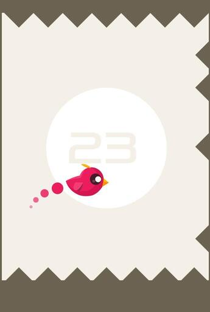

The project is a simple adaptation of the mobile game "Don't touch the spikes" for PC.

Screenshot from the orginal game:

### Technology we used: SFML library

### Brief description of the project:

1. Box Collider:
   - represents a rectangular collider, has methods for setting the collider's position, width and height, checking for collisions with other colliders, retrieving the collider's position, and setting the collider's active state.

2. Spike.hpp:
   - represents a spike - an obstacle for the player, spikes can be rotated and moved, you can check the collision with the player and set their visibility.

3. Player.hpp:
   - represents the player, provides functionalities related to the player's movement, animation and jumping.

4. Level.hpp:
   - represents the level - the map on which the player moves.
   - manages spikes on the board, spikes to be shown on the sides are chosen randomly but difficulty increases and game never gets unplayable there is always safe spot for player to bounce of, 
   - checks for collisions with the player, draws spikes and handles game logic.

5. Game class:
   - The "Game" class manages levels, updates game logic, handles user input, and renders graphics.
